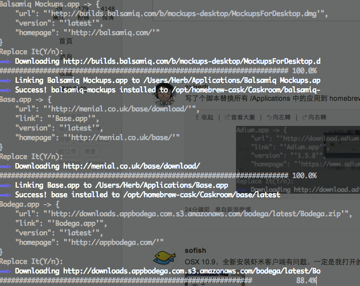

# Minor Fix to Homebrew Cask Replacer Python Script

- Switched order of send2trash of application to make sure brew could correctly copy.
- Updated requirements

*WARNING:*  Make sure that you understand that the application will delete the original app from the Applications folder before getting the files from home-brew. This should in theory be safe but has not been fully tested

# homebrew-cask-replacer

use homebrew cask to replace installed apps



## usage

```bash

pip install -r requirements.txt
python brew_cask_replace.py

```
## how it works

* skip {application} from Appstore [-f turnoff]
* check http://raw.github.com/caskroom/homebrew-cask/master/Casks/{application} is exist
* print application info and check if you want to replace it with brew cask [-y yes to all]
* send old {application_path} to trash (may fail)
* install application using 'brew cask install {application}'

